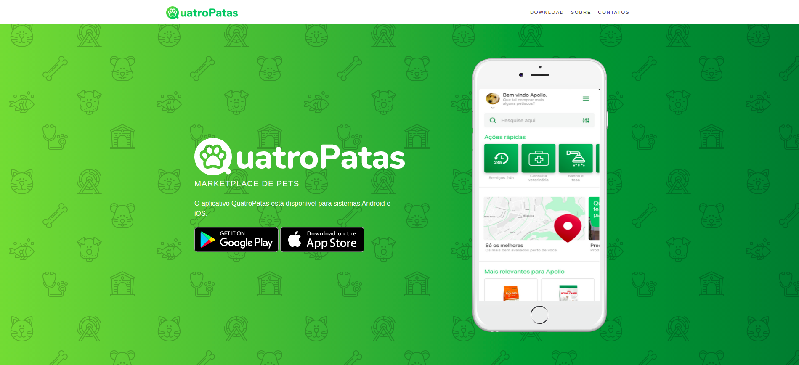
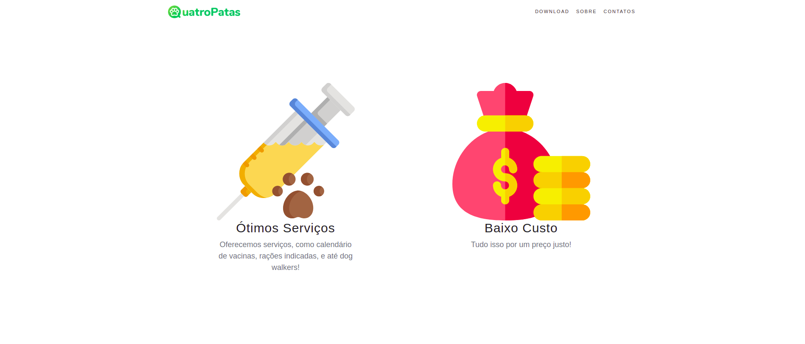
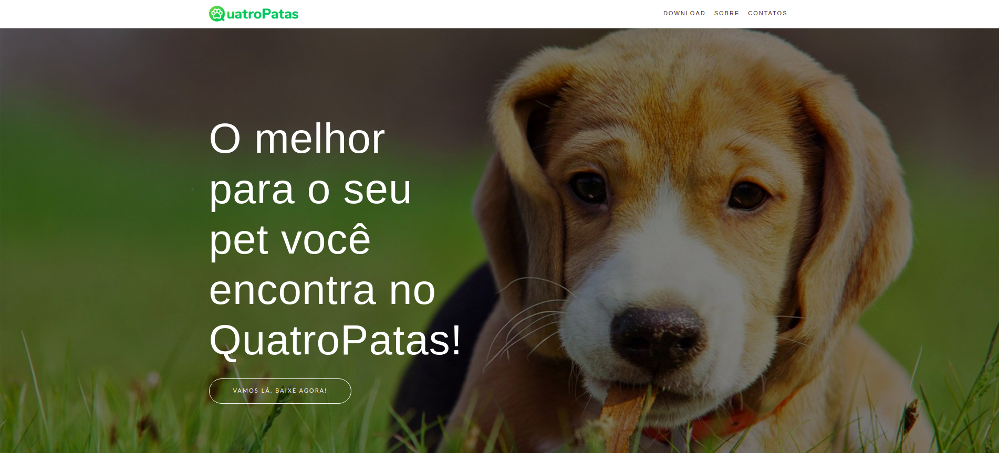
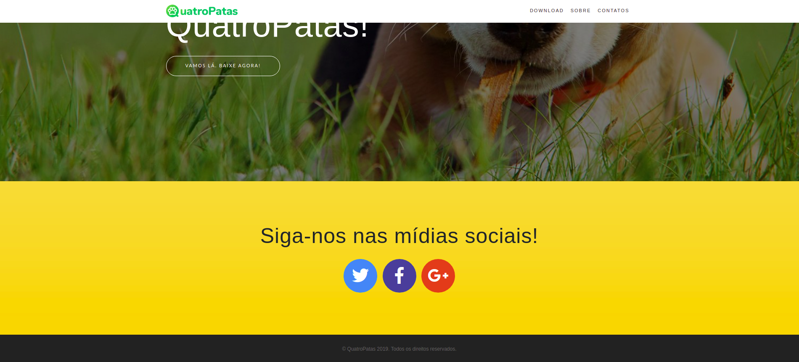

# Landing Page 4Patas           
### Instaling

Install and Create a Virtual environment.

     python3 -m pip install virtualenv
     virtualenv venv -p python3

Activate Virtual Environment: source venv/bin/activate

Install Django: 

     pip install django

Start a new project: 

     django-admin startproject myproject

cd to your project and Run Project:

     cd myproject
     python manage.py runserver

You can see your project here : http://127.0.0.1:8000/

### Screens

